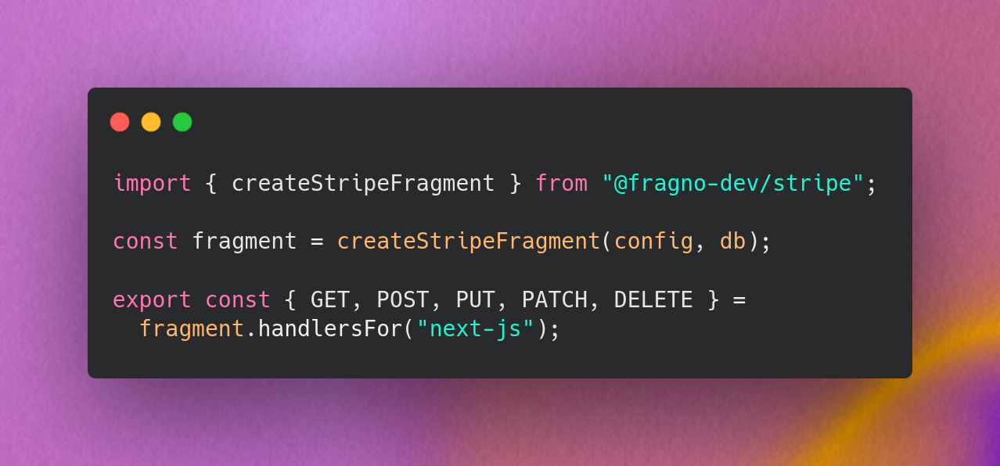

<p align="center">
  
</p>

<br/>
<div align="center">
  <h3>Fragno: Build Full-Stack Libraries</h3>
  <a href="https://fragno.dev">Website</a> •
  <a href="https://fragno.dev/docs">Documentation</a> •
  <a href="https://discord.gg/jdXZxyGCnC">Discord</a>
</div>

<br/>
<br/>

### What's Fragno?

Fragno is a toolkit for building libraries that bundle frontend hooks, backend routes, and a
database schema into a single package. This allows library authors to ship complete features across
the full stack.

**Fragno supports all major frameworks: Next.js, Nuxt, SvelteKit, SolidStart, and more.** Wherever
your users are, Fragno will work. This is also true for the **data layer**: Fragno integrates with
**Kysely** and **Drizzle**, and is database-system agnostic.

Fragno has all features you'd expect from a **modern framework**: type-safe routes, streaming
support, and middleware support. Frontend hooks follow "Stale-While-Revalidate" semantics and allow
arbitrary logic.

When using the **optional** data layer, all database features are fully supported like schema
generation and querying. We also focus on performance and correctness with **indexes and
transactions**.

#### When to use Fragno?

- You are a **Client SDK author** and want to do more than simply wrapping API calls. You can use
  Fragno so your users no longer have to be concerned with webhook handlers and your data model. You
  understand **idempotency** and **at-least-once delivery**, but your users don't have to.
- You want to build **full-stack components** that can be reused across applications, regardless of
  their stack. You see how **Better-Auth is outmaneuvering SaaS auth providers** and want to do the
  same for your vertical.

Either way, you want to use Fragno when you care about a great developer experience for your users,
you care about correctness and performance, and want to have everything tested from the ground up.

#### What it looks like

Start by defining what configuration you need from your users:

```ts
export interface ChatConfig {
  openaiApiKey: string;
  model?: string;
}

export const definition = defineFragment<ChatConfig>("chat")
  .withDependencies(({ config }) => ({ openaiClient: new OpenAI({ apiKey: config.openaiApiKey }) }))
  .build();
```

Then, simply define a route:

```ts
export const routes = defineRoutes(definition).create(({ defineRoute, deps, config }) => {
  const { openaiClient } = deps;

  return [
    defineRoute({
      method: "POST",
      path: "/chat/:id",
      inputSchema: z.object({ message: z.string() }),
      outputSchema: z.any(),
      handler: async ({ input }, { json }) => {
        const { message } = await input.valid();

        return json({
          response: await openaiClient.responses.create({
            model: config.model ?? "gpt-5-nano",
            // ...
          }),
        });
      },
    }),
  ];
});
```

And your client-side hooks:

```ts
const builder = createClientBuilder(definition, options, routes);

const hooks = {
  useChat: builder.createMutator("POST", "/chat/:id"),
};
```

Your users can then immediately use the hooks in their application:

```ts
const { mutate, loading, error } = useChat();
const { response } = await mutate({
  body: { message: prompt },
});
```

#### Example use cases

- **Full-stack components** – opinionated packages that own backend, frontend, and a data layer.
  E.g.:
  - Feature flags
  - Form builder
  - Authentication (Better Auth–style)
  - ...

- **Client SDKs** – packages to facilitate interaction with a SaaS application, such as payments.
  Flows with a lot of webhooks can benefit greatly.

### Documentation

Full documentation can be found at [fragno.dev](https://fragno.dev/docs).

The docs are split in two:

- [For Library Authors](https://fragno.dev/docs/fragno/for-library-authors/getting-started) -
  Everything you need to build Fragno libraries.
- [User Quick Start](https://fragno.dev/docs/fragno/user-quick-start) - This gives you a good idea
  on how users would integrate your library and how they would customize the experience.

#### Quick Start

Basic template to get you started building a full-stack Fragno library:

```bash
# Create a new Fragno library from a template
pnpm create fragno@latest
```

### Features

- **End-to-end type safety**: Standard Schema-compatible route typing and fully type-safe client
  hooks.
- **Built-in frontend state management**: reactive stores with caching and invalidation (TanStack
  Query-style) via [Nano Stores](https://github.com/nanostores/nanostores).
- **Optional data layer**: type-safe database layer with schema generation and adapters for common
  ORMs.
- **Middleware support**: users can plug in authentication, rate limiting, and other cross-cutting
  concerns.
- **Streaming support**: NDJSON (newline-delimited JSON) streaming for real-time use cases.
- **Automatic code splitting**: library-level splitting via `@fragno-dev/unplugin-fragno`, no extra
  build complexity for end users.

#### Data Layer

Define schemas, query with type safety, and write directly to the user's database.

```ts
schema((s) => {
  return s.addTable("conversation", (t) => {
    return t
      .addColumn("id", idColumn())
      .addColumn("messages", column("json"))
      .addColumn("createdAt", column("timestamp"))
      .createIndex("idx_conversation_createdAt", ["createdAt"]);
  });
});
```

**Fragno's schema builder** is intentionally restricted in types to be able to map onto multiple
ORMs and databases. Its basic feature set still contains everything you need to build a rich and
performant schema such as indexes and relationships.

The **query builder** follows the same pattern. Retrieval operations such as filtering and ordering
take indexes as arguments, so it's impossible to write queries that can't be executed efficiently.
Simple joins are supported as well as cursor-based pagination.

**Transactions** are supported via the _Unit of Work_ pattern. This is a two-phase pattern for
atomic operations using optimistic concurrency control (OCC). The first phase **retrieves** the
data, the second phase is responsible for **mutating** the data. When mutating, the OCC pattern
ensures that data isn't modified by another client. This means transactions are non-interactive,
meaning the user's database cannot be blocked for a long time.

We make sure it's easy to **test** everything. Fragno libraries can be easily instantiated in test
environments, the data layer will be backed by a real SQLite or PGLite database. This means you can
easily test full flows, from calling a route to persisting data to the database.

#### Framework and database support

Fragno focuses on a small, framework-agnostic surface (standard `Request`/`Response`) and provides
adapters for many environments.

| Client-side frameworks | Support | —   | Server-side frameworks  | Support |
| ---------------------- | ------- | --- | ----------------------- | ------- |
| React                  | ✅      |     | Node.js / Express       | ✅      |
| Vue                    | ✅      |     | React Router v7 / Remix | ✅      |
| Vanilla JavaScript     | ✅      |     | Astro                   | ✅      |
| Svelte                 | ✅      |     | Next.js                 | ✅      |
| SolidJS                | ✅      |     | Nuxt                    | ✅      |
|                        |         |     | SvelteKit               | ✅      |
|                        |         |     | SolidStart              | ✅      |
|                        |         |     | TanStack Start          | ✅      |

See the [Framework Support](https://fragno.dev/docs/fragno/reference/frameworks) page for the full
and up-to-date list, including database adapter support.

Supported ORMs are Kysely and Drizzle, with Postgres and SQLite. This includes PGLite and Cloudflare
Durable Objects.

### Example Code

This repo ships complete examples and sample libraries:

- `example-fragments/stripe` – A featureful Stripe integration library that manages subscriptions
  and customers. It uses the data layer to consume webhooks from Stripe and write them to the user's
  database. See the [Stripe Quick Start](https://fragno.dev/docs/stripe/quickstart) for more
  details. This full-stack library is also discussed in
  ["Solving Split Brain Integrations"](https://fragno.dev/blog/split-brain-stripe).
- `example-fragments/example-fragment` – minimal Fragno library example.
- `example-apps/*` – full application examples (React Router, Next.js, Nuxt, Astro, SvelteKit,
  SolidStart, Vue SPA, etc.).
- `example-apps/stripe-webshop` – Uses Drizzle and Better Auth with PGLite to integrate the Stripe
  Fragment.

### Contributing

Fragno is an open source project. We welcome contributions! Fragno is licensed under the MIT
License. See the [LICENSE](LICENSE.md) file for details.

See the [CONTRIBUTING](CONTRIBUTING.md) file for details.

<p align="center">
  
</p>

Make sure to star the repo! ⭐️
