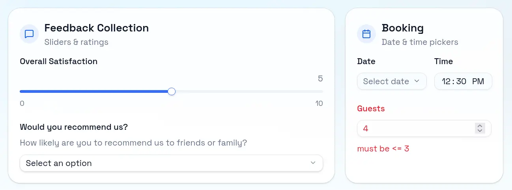

<div align="center">
  <h3>Fragno Forms: Form Builder Library</h3>
  <a href="https://fragno.dev/forms">Live Demo</a> •
  <a href="https://fragno.dev/docs/forms">Documentation</a> •
  <a href="https://fragno.dev/docs/forms/shadcn-renderer">Shadcn Renderer</a> •
  <a href="https://fragno.dev/docs/forms/form-builder">Shadcn Form builder</a>
</div>

The Form fragment for Fragno provides form management and response collection using open standards:
[JSON Schema](https://json-schema.org/) and [JSON Forms](https://jsonforms.io/).

- DB Schemas, request handlers and frontend hooks included
- Store form definitions and responses in your own database
- Form builder shadcn/ui component with Google Forms like UX
- Integrates with any TypeScript stack
- Form validation using Zod/Ajv

<div align="center">

</div>

## Quickstart

### Installation

```bash
npm install @fragno-dev/forms @fragno-dev/db
```

### 1. Initialize the database adapter

See the
[Fragno DB docs](https://fragno.dev/docs/fragno/for-users/database-fragments/overview#choose-your-workflow)
for adapter options. Example with Drizzle ORM and Postgres:

```typescript
import { SqlAdapter } from "@fragno-dev/db/adapters/sql";
import { PostgresDialect } from "@fragno-dev/db/dialects";
import { NodePostgresDriverConfig } from "@fragno-dev/db/drivers";
import { Pool } from "pg";

const dialect = new PostgresDialect({
  pool: new Pool({ connectionString: process.env.DATABASE_URL }),
});

export const fragmentDbAdapter = new SqlAdapter({
  dialect,
  driverConfig: new NodePostgresDriverConfig(),
});
```

### 2. Create server-side instance

```typescript
import { createFormsFragment } from "@fragno-dev/forms";
import { fragmentDbAdapter } from "./db";

export const formsFragment = createFormsFragment(
  {
    onFormCreated: (form) => console.log("Form created:", form.title),
    onResponseSubmitted: (response) => console.log("Response submitted:", response.id),
  },
  { databaseAdapter: fragmentDbAdapter },
);
```

### 3. Mount the fragment routes

Mount the api routes in your web framework of choice.

```typescript
import { Hono } from "hono";
import { formsFragment } from "@/lib/forms";

const app = new Hono();
app.all("/api/forms/*", (c) => formsFragment.handler(c.req.raw));
```

### 4. Generate schemas

```bash
# Generate schema file
npx fragno-cli db generate lib/forms.ts --format drizzle -o db/forms.schema.ts
```

### 5. Secure admin routes

```typescript
import { createFormsFragment } from "@fragno-dev/forms";

export const formsFragment = createFormsFragment(
  {
    // ... your config
  },
  { databaseAdapter },
).withMiddleware(async ({ path, headers }, { error }) => {
  const isAdmin = getUser(headers).role === "admin";

  if (path.startsWith("/admin") && !isAdmin) {
    return error({ message: "Not authorized", code: "NOT_AUTHORIZED" }, 401);
  }
});
```

### Client setup

Create a client instance to use the fragment in your frontend. See
[our docs full reference of all hooks](https://fragno.dev/docs/forms/hooks).

```typescript
import { createFormsClient } from "@fragno-dev/forms/react";

export const formsClient = createFormsClient();

const { data: form } = formsClient.useForm({ slug: "my-form" });
const { mutate: submitForm } = formsClient.useSubmitForm({ slug: "my-form" });
// For admins
const { data: submissions } = formsClient.useSubmissions({ id });
```

### Form Builder

For shadcn/ui projects, we provide a visual form builder component:

```bash
pnpm dlx shadcn@latest add https://fragno.dev/forms/form-builder.json
```

### Creating a Form

Forms can be created dynamically at runtime using the admin hooks, or defined statically in code.

```typescript
const { mutate: createForm } = formsClient.useCreateForm();

await createForm({
  body: {
    title: "Contact Us",
    slug: "contact",
    status: "open",
    dataSchema: {
      type: "object",
      properties: {
        name: { type: "string", minLength: 1 },
        email: { type: "string", format: "email" },
        message: { type: "string", minLength: 10 },
      },
      required: ["name", "email", "message"],
    },
    uiSchema: {
      type: "VerticalLayout",
      elements: [
        { type: "Control", scope: "#/properties/name" },
        { type: "Control", scope: "#/properties/email" },
        { type: "Control", scope: "#/properties/message", options: { multi: true } },
      ],
    },
  },
});
```

### Submitting a Form

```typescript
const { data: form } = formsClient.useForm({ pathParams: { slug: "contact" } });
const { mutate: submit } = formsClient.useSubmitForm();

await submit({
  pathParams: { slug: "contact" },
  body: { data: formData },
});
```

### Rendering Forms

The Form fragment stores forms using [JSON Schema](https://json-schema.org/) for data validation and
[JSONForms UI Schema](https://jsonforms.io/) for layout.

[JSONForms](https://jsonforms.io/) renders forms from these schemas and supports multiple renderer
sets including Material UI, Vanilla, and custom implementations. For shadcn/ui projects, see our
[ShadCN Renderer](https://fragno.dev/docs/forms/shadcn-renderer).
