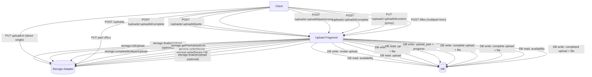

# Upload Fragment

Full-stack upload fragment for Fragno. It supports direct-to-storage uploads (signed URLs), proxy
uploads, and one-shot multipart form uploads. Strategy selection is driven by the storage adapter in
`storage.initUpload` and the configured thresholds.

## Upload Inventory

Routes below are relative to the fragment mount (for example, `/api/uploads`).

**Direct single (signed URL to storage)** Steps:

1. `POST /uploads` returns `uploadUrl` + `uploadHeaders`. Writes: `upload`.
2. Client `PUT` to the signed URL. Writes: none.
3. `POST /uploads/:uploadId/complete`. Writes: `upload`, `file`.
4. Optional `POST /uploads/:uploadId/progress`. Writes: `upload`.

Storage ops: `initUpload` (before DB availability checks), optional `finalizeUpload` (before
completion writes). DB ops: after `initUpload`, read `file` + `upload` (availability), write
`upload`, then mark complete + insert `file`.

**Direct multipart (signed part URLs)** Steps:

1. `POST /uploads` creates the upload. Writes: `upload`.
2. `POST /uploads/:uploadId/parts` returns signed part URLs. Writes: none.
3. Client `PUT` to part URLs. Writes: none.
4. `POST /uploads/:uploadId/parts/complete`. Writes: `upload_part`, `upload`.
5. `POST /uploads/:uploadId/complete`. Writes: `upload`, `file`.

Storage ops: `initUpload` (before DB availability checks), `getPartUploadUrls`,
`completeMultipartUpload`. DB ops: after `initUpload`, read `file` + `upload` (availability) and
write `upload`; later read `upload`, write `upload_part` rows + progress, then mark complete +
insert `file`.

**Proxy stream (upload session)** Steps:

1. `POST /uploads` creates the upload. Writes: `upload`.
2. `PUT /uploads/:uploadId/content` streams content through the fragment. Writes: `upload`, `file`.

Storage ops: `initUpload` (before DB availability checks), `writeStream`. DB ops: after
`initUpload`, read `file` + `upload` (availability) and write `upload`; then mark complete + insert
`file` (or mark failed on storage error).

**One-shot multipart form (server mediated)** Steps:

1. `POST /files` with `multipart/form-data`. Writes: `upload`, `file`.
2. Server chooses proxy stream or server-side `PUT` to `uploadUrl`. Writes: none.
3. Upload finalizes on success. Writes: none.

Storage ops: `initUpload`, `writeStream` OR server `PUT` to `uploadUrl`, optional `finalizeUpload`
(before DB writes). DB ops: after storage succeeds, read availability, then create completed
`upload` + `file` (or failed `upload` on error).

Note: If `initUpload` returns `direct-multipart`, this route responds with
`409 UPLOAD_INVALID_STATE` and you should use the multipart session flow instead.

**Helpers (status, progress, abort)** Steps:

1. `GET /uploads/:uploadId` fetches status. Writes: none.
2. `POST /uploads/:uploadId/progress` records progress. Writes: `upload`.
3. `POST /uploads/:uploadId/abort` cancels the upload. Writes: `upload`.

## Upload Flow Diagram



## Durable Hooks and DB Entities

Durable hooks are persisted to the internal `fragno_hooks` table when `uow.triggerHook(...)` is
called inside a DB transaction. Hook execution is out-of-band and may re-read or update upload
entities.

**onUploadTimeout (scheduled when `POST /uploads` creates a new upload)** Steps:

1. Writes: `fragno_hooks` (process time = `upload.expiresAt`, payload includes `uploadId`).
2. When executed, reads: `upload`. If still active and expired, writes: `upload` (status `expired`,
   error fields, timestamps).
3. Invokes `config.onUploadFailed` (no DB writes from the hook itself).

**onFileReady (after `upload` completes + `file` is created)** Steps:

1. Writes: `fragno_hooks`.
2. Hook execution is notification-only; no DB writes.

**onUploadFailed (after upload failure or abort)** Steps:

1. Writes: `fragno_hooks`.
2. Hook execution is notification-only; no DB writes.

**onFileDeleted (after `file` is marked deleted)** Steps:

1. Writes: `fragno_hooks`.
2. Hook execution is notification-only; no DB writes.

## Build

```bash
npm run types:check
npm run build
```

## CLI

The upload fragment ships with a CLI to interact with its HTTP API.

```bash
# From the workspace
pnpm -C packages/fragment-upload build
node packages/fragment-upload/bin/run.js --help
```

```bash
# Use the CLI (base URL points to the mounted upload fragment)
fragno-upload --help
fragno-upload uploads create -b https://host.example.com/api/uploads --file-key s~Zm9v --filename demo.txt --size-bytes 10 --content-type text/plain
fragno-upload uploads transfer -b https://host.example.com/api/uploads -f ./demo.txt --file-key s~Zm9v
fragno-upload files list -b https://host.example.com/api/uploads --prefix s~Zm9v.
fragno-upload files download -b https://host.example.com/api/uploads --file-key s~Zm9v -o ./download.txt
```

Environment defaults:

- `FRAGNO_UPLOAD_BASE_URL`
- `FRAGNO_UPLOAD_HEADERS`
- `FRAGNO_UPLOAD_TIMEOUT_MS`
- `FRAGNO_UPLOAD_RETRIES`
- `FRAGNO_UPLOAD_RETRY_DELAY_MS`
