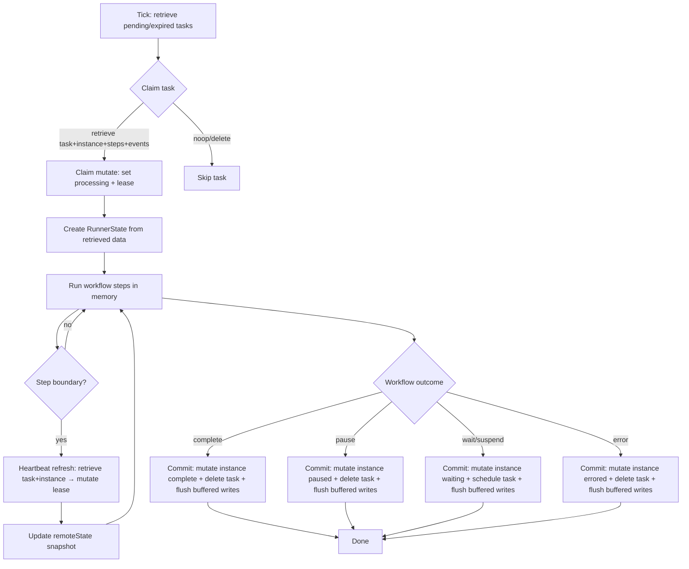

# Workflow State Flow

This document summarizes how workflow state is loaded, held, and persisted during execution.

## In-Memory State

- `RunnerState.instance`: claimed instance snapshot for this task run
- `RunnerState.stepsByKey`: cached step snapshots keyed by `stepKey`
- `RunnerState.events`: cached event list for the run
- `RunnerState.mutations`: buffered creates/updates for steps/events/logs
- `RunnerState.remoteState`: latest pause/terminal snapshot from heartbeat
- `RunnerState.remoteStateRefresh`: refresh hook that performs the lease heartbeat tx

## Database Roundtrips (Phases)

- **Tick scan**: retrieve pending + expired tasks (read-only)
- **Claim**: retrieve task + instance + steps + events → mutate task lease/status
- **Heartbeat**: retrieve task + instance → mutate lease + refresh `remoteState`
- **Commit**: mutate instance + task + buffered step/event/log writes (single mutate phase)
- **Conflict fallback** (rare): retrieve instance → mutate pause/delete + buffered writes

## State Flow (Mermaid)

## State Guarantees

- All step/event/log persistence is buffered in memory and written once in the commit mutate phase.
- Pause/terminate decisions use the latest `remoteState` from the heartbeat transaction.
- Optimistic concurrency checks (`.check()`) are applied when IDs include version info.
